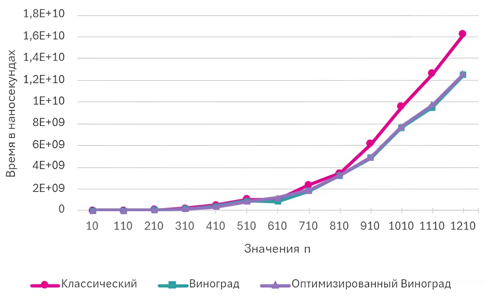

# Оптимизация алгоритмов умножения матриц (C++)

Раздел содержит реализацию и сравнительный анализ производительности алгоритмов умножения плотных матриц. Продемонстрировано применение алгоритмических оптимизаций (алгоритм Винограда) для снижения асимптотической сложности и повышения скорости вычислений.

## Реализованные алгоритмы

1.  **Стандартный алгоритм** — классическое перемножение со сложностью $O(N^3)$.
2.  **Алгоритм Винограда** — метод, снижающий количество операций умножения за счет предварительного вычисления произведений по строкам и столбцам.
3.  **Модифицированный алгоритм Винограда** — оптимизация с заменой арифметического умножения на побитовые сдвиги (`<< 1`) для ускорения вычислений на уровне процессорных инструкций.

## Особенности реализации

* **Оптимизация работы с оперативной памятью:** данные матрицы хранятся в непрерывном одномерном массиве. Это обеспечивает локальность данных.
* **Автоматическое управление ресурсами:** реализовано на принципах RAII. Исключены утечки памяти и использование глобальных переменных.
* **Измерение производительности:** используется библиотека `std::chrono` для замера чистого времени выполнения вычислений без учета времени ввода-вывода.

## Анализ производительности

Ниже представлен график зависимости времени выполнения алгоритмов от размерности матрицы ($N \times N$), построенный на основе экспериментальных данных.

Согласно полученным данным, на матрицах размерностью свыше $800 \times 800$ алгоритм Винограда показывает стабильное преимущество в скорости по сравнению со стандартным методом за счет снижения константы скрытой сложности при главном члене.

## Теоретическая оценка трудоемкости

Оценка числа базовых операций ($f$) для стандартного алгоритма:
$$f = 2 + 4A + 7AC + 11ABC$$

Оценка числа базовых операций ($f$) для алгоритма Винограда (для четной размерности):
$$f = 8 + 9A + 5B + 7.5AB + 7.5BC + 13AC + 13ABC$$