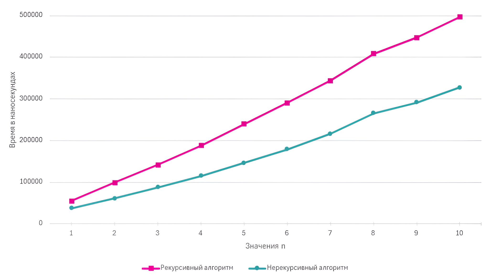

# Профилирование накладных расходов: Рекурсия vs Итерация (C++)

Данный микро-проект посвящен сравнительному анализу производительности и потребления памяти при рекурсивном и итеративном подходах на примере базового математического алгоритма. 

Основная цель - практическая оценка накладных расходов процессорного времени на управление стеком вызовов и анализ асимптотической сложности по памяти.

## Анализ сложности

| Алгоритм | Временная сложность | Пространственная сложность (Память) | Причина потребления памяти |
| :--- | :--- | :--- | :--- |
| **Итеративный** | $O(\log n)$ | $O(1)$ | Используются только локальные регистры/переменные. |
| **Рекурсивный** | $O(\log n)$ | $O(\log n)$ | Выделение памяти в стеке вызовов для каждого фрейма функции. |

*Примечание: Временная сложность $O(\log n)$ обусловлена тем, что количество операций пропорционально количеству цифр числа, которое логарифмически зависит от самого значения $n$.*

## Особенности реализации
* Для массированного тестирования применяется вихрь Мерсенна (`std::mt19937` из библиотеки `<random>`).
* Замеры времени производятся высокоточным таймером `std::chrono::high_resolution_clock` с разрешением до наносекунд.
* Реализована строгая валидация пользовательского ввода для защиты от некорректных типов данных и переполнения.

## Результаты профилирования

Тестирование проводилось на выборке из 10 000 итераций для каждой разрядности числа (от 1 до 10 знаков). 

### Инженерные выводы
Несмотря на идентичную асимптотическую сложность по времени $O(\log n)$, на практике итеративный алгоритм демонстрирует стабильно более высокую производительность. Это связано с отсутствием накладных расходов процессора на:
1. Сохранение контекста функции.
2. Выделение памяти под новые локальные переменные в каждом фрейме.
3. Возврат управления по адресу вызова.

Итеративный подход в данном классе задач является предпочтительным из-за абсолютной безопасности с точки зрения переполнения стека и лучшей утилизации процессорного кэша.

## Полная документация

Более подробное описание алгоритмов, математические выкладки и полные результаты тестирования доступны в академическом отчете:
* [Скачать / Посмотреть полный отчет (PDF)](docs/Lab_02_Report_Recursion_vs_Iteration.pdf)